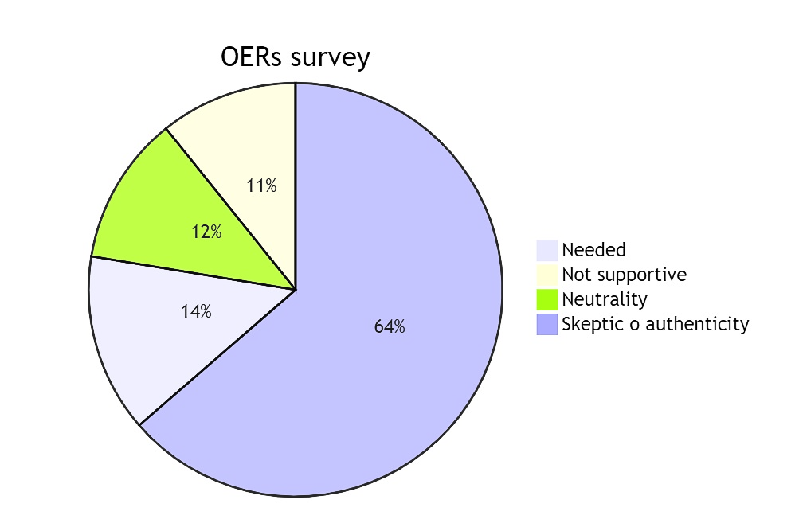
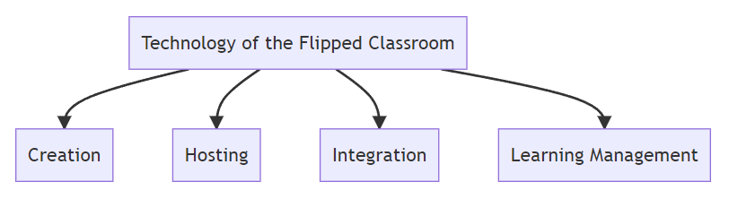
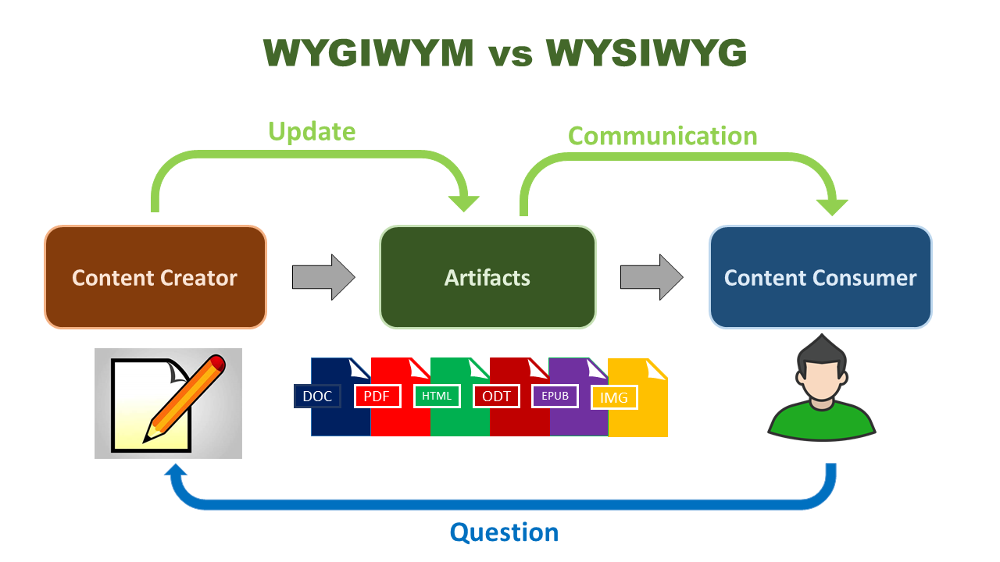
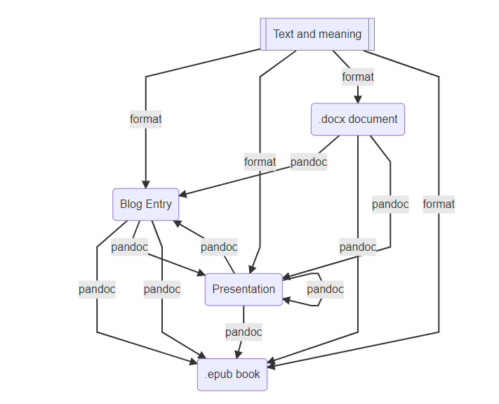

---

marp: true
theme: gaia
paginate: true
header: ""
footer: " LOVEDISTANCE"
size: 16:9

---

<!-- _paginate: false -->
<!-- _class: lead -->

##  <!-- fit -->  Markdown Authoring
## Anxo Sánchez Bermúdez
## University of de Vigo

---
<!-- header: "" -->
<!-- footer: "" -->
<!-- _paginate: false -->
<!-- _class: lead -->

# <!-- fit --> Curation of Educationa Resources

---

<!-- class: invert -->

## <!-- fit --> Challenges in identifying and utilizing the OERs.



<!-- Presenter notes 
There is inadequate perception among teacher educators on availability and usability of relevant OER for teaching the contents.
Teacher Educators are varied on their perception regarding OER as relevant and active support to teach content. 
18% of teacher educators perceived the OER as need of the hour while
13.88% perceived OER as not supportive.
68% perceived with neutrality.
82% of teacher educators are skeptic on authenticity of available online resources including OER materials.
-->
---

## Teacher Perception

 - Most of the teachers guarantee the credibility of online resources only after verifying with the text book resources.
 - They have 'tendency to compare' the relevance and quality of online materials with Books.
 - The study reflects need of awareness programmes for teacher educators on OER and its utilization. 
 - Curation is needeed to adjudicate the credence and quality of the materials.

_Journal of Educational Technology_, v15, n2, p55-61, Jul-Sep **2018**

---

## Curation vs Creation Dilema: Flipped Class



- Content creation is when you create your own materials from scratch:
  - presentations, 
  - assignments 
  - assessments.
  <!-- - You mostly likely already engage in a mix of content creation and content curation.
- Content creation is when you create your own materials from scratch—from syllabi, presentations, assignments and assessments.
- You realize that you’re a one-stop shop education machine!.
- You don’t write your own new course materials every semester. 
- Instead, you think about the use of existing content where it suits your needs.
-->

---

## What to do?

- Skip borrow material from past. This is content curation.
- Balancing content creation with curation for an effective design.
- Take resources developed by trusted sources. Curation is one tool.
- Curation improves student success keeping supplemental materials costs affordable .
- Curating high-quality content prevents you from unnecessarily duplicating content (MMOER). 

---

## OER Curation

[OER Curation Kit](https://www.education.ne.gov/educational-technology/oer/oer-toolkit-curation/#1550863946581-1fce08bd-2c1b)

- Consider collaborating with others
- Conduct your searches in recognized repositories
- Become familiar with open licensing and accessibility requirements
- Determine your evaluation criteria
<!-- Contents: [About OER] -->

---

## Recommendations

- Limit the amount of copyrighted materials posted to Moodle
- Use links to legal copies of materials, rather than creating and uploading copies to Moodle. Reasons linking is preferable include:
- Consider this a teachable moment: teach to find
- Using films and music within Moodle carefully
- Delete copyrighted content after the class ends

---

<!-- _paginate: false -->
<!-- _class: lead -->

## <!-- fit --> Creating Materials

---

## Frustrations with  word processors

- Most teachers I know fall into one of two groups: **Microsoft Word'ers** or **Google Docs'ers**
- Both are terrible, especially in a world where there’s Markdown.
- When we want share with students we use **PDF** format.
- Make presentations with **Powerpoint**, **Impress** or **Google Slides** ...
- Try to convert a **MS word ```docx```** file to **MS PowerPoint ```pptx```** and then share it in **Adobe ```pdf```**!

---




---

## What is markdown?

Markdown is a markup language. The Markdown language lets you write plain text documents with a few annotations that specify the document format. Format is independet of source.

- Text: headers, footers, etc.
- Fonts and font sizes.
- Line, page numbes, etc.

---

## What is not markdown?

- A WYSIWYG (what you see is what you get) editor.
- You decide your text with information (chapters, sections, etc), but not its format.

This workflow paradigm makes it easier to produce different kinds of outputs. Working together with [pandoc](https://pandoc.org) your markdown source can easily be transformed into other formats like HTML, PDF, or DOCX

---

## Markdown Principal Characteristics

- Markdown is simple. Annotations are minimal, and in made in plain text.
- Markdown is generates easyly documents in other markup languages or formats.
- It uses also templa so you can write custom templates and stylesheets.
- Math expresions are writen in LaTeX.
- It uses Pandoc as translation support (several extensions.)

---

## Why Use Markdown

- If you are an content author which changes versions and outputs formats (like a learner)
- If you thing WYSIWYG editors such as Microsoft Word can ba a nightmare.
- When you share your documents with others, the use of plain text is a good idea.
- Plain text editors are free, light and portable. If you are authoring in plain text file, you know exactly what you are editing.
- If you need your document in different formats, for example, pdf, slides, etc. 

---

## Semantics vs Format

- Texts consist of chapters and sections, plain text and emphasized text, figures and citations, quotes, and lists. 
- Semantic elements are visualized by different fonts, bold and italic text, different font sizes, and we do not directly see the semantic structure.
- Most word processors separate semantics from formatting. 
- Using WYSIWYG word processors doesn’t prevent you from structuring your documents as semantic units—they.

---

## Preprocessing Documents

- There are a lot of options in order to process documents before convert them into a final output.
- There are a lot of tools that will work well with plain text and markdown as preprocessors.
- Preprocessing documents often require a few programming skills, so it might not be the first thing to learn about markdown

---

# Concepts 

- First, we can learn about:
  - Files
  - Templates
  - Style sheets
  - Outputs
  - Pandoc

---

# Markdown Process

<!-- backgroundColor: gray -->


- You can translate the text in multiple documents, or merge multiple chapters into a single one.
- You combine templates for formatting the documents, and using **Pandoc* to produce the documents you want.

---

<!-- backgroundColor: white -->
<!-- color: black -->

## Markdown
## Pandoc
## Pathways



---
<!-- backgroundColor: default -->
<!-- color: default -->
 Why Use MarkdoWn and pandoc?

- You can write without worrying about it initially, and format later.
- You have a lot of code examples.
- You use math formulas
- You make graphs or charts with online software
- Yu wabt easily capture web pages
- You share documents with many people
- You use online sites that can render markdown (Moodle, Jupyter, wordpress, Hugo, etc)

---

Why Markdown?

- It's a markup languege easier to leran than any other (HTML)
- Is much easy but compayibler with TeX and LaTeX
- What makes Markdown particularly pleasant to work with is its simplicity.

- Consider this Markdown document:

```markdown
- One
- Two
```

---

# In LateX

```latex
\begin{itemize}
\item One
\item Two
\end{itemize}
```
# In HTML

```html
<ul>
<li>One</li>
<li>Two</li>
</ul>
```
----

## Why Pandoc?

- Since Markdown is just a language for adding structure to a text, it is not tied to any particular tool.
- Many blogging platforms accep Markdown and automatically format it for you to HTML (**Moodle**).
- Now, many text editors also support Markdown but may be you need to export to different file formats and in different styles, then that is obviously the easiest way for you to export your Markdown text. 
- Pandoc is vastly more versatile than any Markdown-aware text editor.

---

# Writing Markdown

```markdown
# Header level 1
## Header level 2
### Header level 3
```
# Header level 1
## Header level 2
### Header level 3

---

# Emphasis

```markdown
*Italics* or _Italics_
**Bold** or __Bold__
_**Italic Bold**_
**_Italic Bold_**
```
*Italics* or _Italics_
**Bold** or __Bold__
_**Italic Bold**_
**_Italic Bold_**

---

# Lists

```markown
1. This is a numbered list.
2. Where this is list item two.
3. And this is list item three.
```

1. This is a numbered list.
2. Where this is list item two.
3. And this is list item three.

---

```markdown
1. This is a multi-line list item.
   This is also part of the list item.
   And so is this
2. Here is another one.
   Where this is also part of the list item.
```

1. This is a multi-line list item. This is also part of the
   list item. And so is this.
2. Here is another one. Where this is also part of the list
   item.

---

# Sublists

```markdown
- This is a top-level list item
    - Here is a sublist item
    - Here is another
```
- This is a top-level list item
    - Here is a sublist item
    - Here is another

---

# Block Quotes

```markdown
> This is a blockquote. The blockquote
>  can span multiple lines. If you don't
> put any new lines in it, you only
```

> This is a blockquote. The blockquote
> can span multiple lines. If you don't
> put any new lines in it, you only

---

# Verbatim Text 

\`\`\`
This will be shown absolutely verbatim
\`\`\`

The result will then look like this:

```
This will be shown absolutely verbatim
```

---

# Links

This is a link to [my blog](https://anxosanchez.github.io/eqi2/).

This is a link to [[these slides](https://anxosanchez.github.io/LOVEDISTANCE_Slides/)]

This is a link to [the section](https://pdf2md.morethan.io/#verbatim).

---

## Math fórmulas

$$
\frac{\partial (\rho u_{i})}{\partial t} + \frac{\partial[\rho u_{i}u_{j}]}{\partial x_{j}} = -\frac{\partial p}{\partial x_{i}} + \frac{\partial \tau_{ij}}{\partial x_{j}} + \rho f_{i}
$$
$$
\frac{\partial \rho}{\partial t} + \overrightarrow{\nabla}\cdot(\rho\overrightarrow{u})=0 
$$
$$
\frac{\partial(\rho \overrightarrow{u})}{\partial t} + \overrightarrow{\nabla}\cdot[\rho\overline{\overline{u\otimes u}}] = -\overrightarrow{\nabla p} + \overrightarrow{\nabla}\cdot\overline{\overline{\tau}} + \rho\overrightarrow{f}
$$

---

```markdown
a. This list uses letters instead of numbers.
b. We can make a sublist with roman numerals:
i. This sublist also uses parenthesis
ii. Cool, isn’t it?
```

looks like

a. This list uses letters instead of numbers.
b. We can make a sublist with a roman numerals:
i. This sublist also uses parenthesis
ii. Cool, isn’t it?

---

<!-- color: default -->
## Images


---

# Combined with HTML

<style>
img[alt~="center"] {
  display: block;
  margin: 0 auto;
}
</style>


---

## Video


<iframe width="560" height="315" src="https://www.youtube.com/embed/AOaxhU1yxOM" title="YouTube video player" frameborder="0" allow="accelerometer; autoplay; clipboard-write; encrypted-media; gyroscope; picture-in-picture" allowfullscreen></iframe>

---

# Tables

```markdown
| Right | Left | Default | Center |
| ----: | :--- | :------ | :----: |
|    12 | 12   | 12      |   12   |
|   123 | 123  | 123     |  123   |
```
Result:
| Right | Left | Default | Center |
| ----: | :--- | :------ | :----: |
|    12 | 12   | 12      |   12   |
|   123 | 123  | 123     |  123   |

---

## Mermaid Diagrams

](https://mermaid.live/edit#pako:eNpt0M2qAjEMBeBXidk68wJdKILC1a3bbkJ7dMrtj9YWEfHd7YzjzqwC-U4gebJJFqz4hmtFNNg6OWcJOlKrjXcG_Wq1PKQhKvqD94nGvqMh3Uky6JHq-if-MCNxJDRAMgXMdJz1jfZTpi12n3RH-ykx6RZb_OZ7OgGezhlSZvIt7jggB3G23fQcZ5rLgADNqrVW8r9mHV_N1YuVgp11JWVWJ_E3dCy1pOMjGlYlV3zR_JRZvd5_C2Gl)

---

# Footnotes

Footnote inside a paragraph.[^1]

Reference to a footnote.[[1\]](https://pdf2md.morethan.io/#fn1)

[^1]: This is footnote one.

---

# Syntax Highligthing

```python
for (int i = 0; i < n; i++) 
printf("%d\n", i);
```

```matlab
function v = f(x);
    v = exp(a^3)  - x
```
---

# Maths

```latex
$$p_k(x)=\prod_{\substack{i=1\\i\ne k}}^n
\left(\frac{x-t_i}{t_k-t_i}\right)$$
```
looks like

$$p_k(x)=\prod_{\substack{i=1\\i\ne k}}^n
\left(\frac{x-t_i}{t_k-t_i}\right)$$

---

# Presenter notes

```
<!-- This is a presenter note for this page. -->
<!-- EXAMPLE: An EXAMPLE directive is not defined in Marp/Marpit, so this works as presenter notes. -->
```
```<!-- fit -->``` This is not a presenter note.

---

<!-- class: lead -->

# <!-- fit --> Thank you!
## Creative Commos License
 

